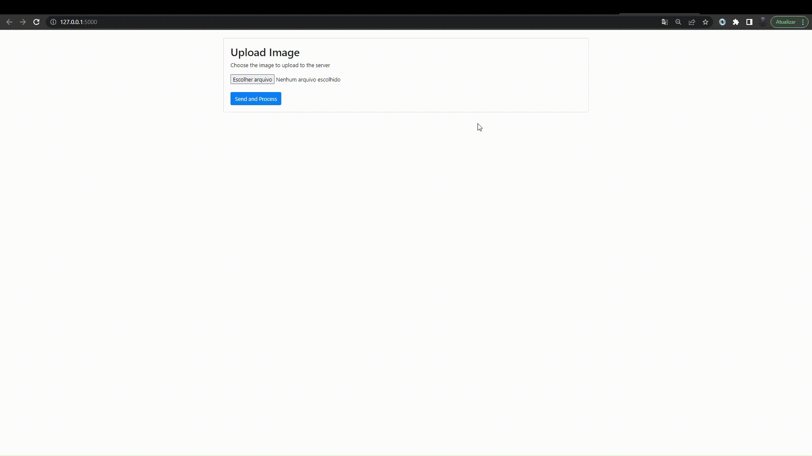

# API demonstrating image size transformation using python and flask



[](https://www.npmjs.com/package/n) [](https://www.npmjs.com/package/n) 

## *Objective:*
This project aims to demonstrate, in a simple and clear way, the decrease in size of an image, modifying the quality but without deforming the image in the final result.

## *Installing*

```sh
git clone https://github.com/danilosoftwares/ImageTransform
cd ImageTransform
pip install -r requirements.txt
```

## License

MIT

